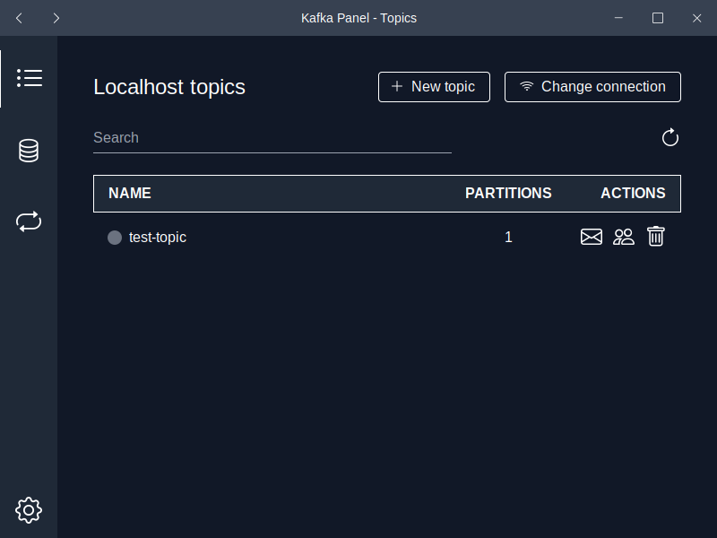

<div align="center">
  
  <h3>Kafka Panel</h3>
  <p>
    Simple developer oriented admin panel for your <a href="https://kafka.apache.org">Apache kafka</a> clusters
    <br />
    <a href="https://github.com/ianFar96/kafka_panel/issues">Report Bug</a>
    ·
    <a href="https://github.com/ianFar96/kafka_panel/issues">Request Feature</a>
  </p>
</div>

## About the project



Kafka Panel is a desktop app for Linux (*) made to manage your [Apache Kafka](https://kafka.apache.org) clusters. It is designed to be simple for the use of Software Developers who only need to handle basic operations, like create topic, delete topic, produce a message, etc (check out the [Usage section](#usage) to discover all the features)

\* Mac and Windows are not officially supported right now due to some problems in the publish release pipeline but since the project is made with [Tauri](https://tauri.app/) you can always clone it and build the package for your OS with the command `npm ci && npm run tauri build`.

## Getting Started

### Installation

To install Kafka Panel you just need to head to the [Releases page](https://github.com/ianFar96/kafka_panel/releases) and download the most recent one.

### Usage

Here is explained for each page what features it provides and how to use them.

#### Topics

Topics page provides you with a quick overview of the topics, where you can create see a list and delete them. You can also change the connection (configured in Settings page) which will give you access to all the topics that specific user has permissions on.

You might also notice the small dot besides every topic, this is the "topic status" where it can be `Consuming` meaning that there's a consumer connected to it, `Disconnected` meaning it has committed offsets to it but is not currently being consumed, and `Unconnected` which means your topic has no metadata relative to any consumer group. You will also see this pattern in the [Groups page](#groups)

#### Messages

Messages page is where you can see the **latest** messages your topic has. A maximum of messages can be configured and by default is `20`. Of course you can also send messages by starting from blank or selecting one of the already existing messages as starting point.

#### Groups

In Groups page you see the consumer groups connected to your topic with the status indicator that we saw in the [Topics page](#topics) and the **lag**.

You can also move the offsets forward to skip certain messages, but only when the consumer group is disconnected and of course there's lag.

#### Messages Storage

Messages Storage page is meant to provide you with a local storage of your favorite messages from all the topics and connections. Not only that, it also allows you to send each message to whatever connection and whatever topic you'd like.

Messages can be saved in storage with the little "DB" icon you'll find on each message you've already sent, specifying some **tags** before saving to make your search easier in the future.

#### Autosends

Autosends page lets you configure multiple auto message sending processes where you can specify duration, interval, connection/topic and the message template to send. 

Message templates have at their disposition the full power of [faker.js](https://fakerjs.dev/), to use it you just need to declare a string with double brackets and write any faker js function you want, for example `"{{faker.person.firstName('female')}}"`. You also can use the values generated in the key object to populate the value object.

#### Settings

Last but not least, the settings page lets you configure your connections to your cluster with a simple json.

Example:

```json
[
  {
    "name": "Localhost",
    "brokers": [
      "localhost:9092"
    ]
  },
  {
    "name": "Remote cluster 1",
    "brokers": [
      "some-long-address-to-the-node-cluster-1:9093",
      "some-long-address-to-the-node-cluster-1-broker-2:9093"
    ],
    "auth": {
      "username": "Username",
      "password": "Password",
      "mechanism": "SCRAM-SHA-256"
    },
    "groupPrefix": "some-prefix-authorized-by-acls"
  }
]
```

## Contributing

Contributions are what make the open source community such an amazing place to learn, inspire, and create. Any contributions you make are **greatly appreciated**.

If you have a suggestion that would make this better, please fork the repo and create a pull request. You can also simply open an issue with the tag "enhancement".
Don't forget to give the project a star! Thanks again!

1. Fork the Project
2. Create your Feature Branch (`git checkout -b feature/AmazingFeature`)
3. Commit your Changes (`git commit -m 'Add some AmazingFeature'`)
4. Push to the Branch (`git push origin feature/AmazingFeature`)
5. Open a Pull Request

## License

Distributed under the MIT License. See `LICENSE` for more information.

## Acknowledgments

<a href="https://icons.getbootstrap.com/" title="bootstrap icons">Icons used from Bootstrap icons</a>
<br />
<a href="https://www.flaticon.com/free-icons/hermes" title="hermes icons">Hermes icons created by Freepik - Flaticon</a>
